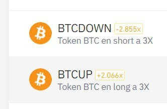
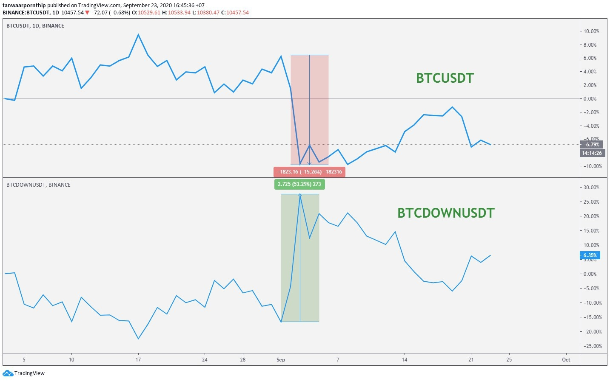
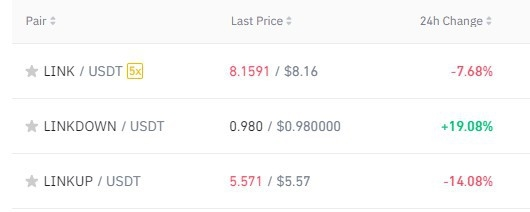

# Binance leveraged tokens

## Binance leveraged Tokens \(BLVT\) คืออะไร?

อ้างอิงจาก [https://www.binance.com/en/support/faq/360042957472](https://www.binance.com/en/support/faq/360042957472)

BLVT คือเหรียญสังเคราะห์ที่ Binance ผลิตขึ้นมาเพื่อให้ราคาของเหรียญขยับตามราคาของเหรียญอ้างอิง โดยจะขยับมากกว่าเหรียญอ้างอิง ระหว่าง 1.5 - 3 เท่า

โดยสามารถขยับได้ทั้งสองแบบ ขอยกตัวอย่างเหรียญสองตัวนี้ก่อนนะครับ BTCDOWN กับ BTCUP เหรียญ BTCDOWN จะมีราคาเพิ่มขึ้น ถ้าเหรียญอ้างอิง \(BTC\) ราคาตก เหรียญ BTCUP จะมีราคาเพิ่มขึ้น ถ้าเหรียญอ้างอิง BTC ราคาขึ้น จำนวน x ที่เห็นอยู่ด้านหลังคือจำนวนเท่า ณ ปัจจุบันซึ่งปรับได้ตามที่ Binance เห็นควรครับ กลับไปดูที่ตัวอย่างรูปด้านบนอีกครั้ง ซึ่งเปรียบเทียบ BTCUSDT กับ BTCDOWNUSDT ในช่วงที่เหรียญอ้างอิง BTC ราคาตก จะเห็นว่า BTC ราคาตก 15.26% แต่ BTCDOWNUSDT ราคาขึ้นถึง 53% เพราะว่ามี leverage ระหว่าง 1.5-3x ต่อวัน

ข้อดีของเหรียญ BLVT คือ 1. สามารถซื้อขายได้บนตลาด SPOT ซื้อขายเหมือนเหรียญตัวอื่น 2. สามารถเก็งกำไรจากเหรียญที่ราคาร่วงได้ โดยซื้อ เหรียญที่ลงท้ายด้วย DOWN เช่น BTCDOWN ETHDOWN ADADOWN 3. สามารถเพิ่มกำไรจากเหรียญที่ราคาขึ้นได้ โดยซื้อเหรียญที่ลงท้ายด้วย UP เช่น BTCUP ETHUP ADAUP 4. ไม่ต้องกังวลเรื่อง leverage เพราะว่า Binance เลือกให้อยู่ระหว่าง 1.5-3% 5. ไม่มีการ liquidate เนื่องจาก BLVT จะทำการปรับไซส์อัตโนมัติ

ข้อเสียคือ 1. ต้องจ่ายค่าบริหารจัดการ \(ดูในเอกสารของ Binance\) แต่ก็พอ ๆ กับจ่ายค่า margin หรือ funding fee 2. ไม่สามารถเซ็ต leverage ที่เป๊ะ ๆ ได้เนื่องจาก Binance เซ็ตให้

เหมาะกับนักเทรดประเภทใด 1. คนที่ใช้ spot market เป็นอยู่แล้ว และอยากเริ่มทำกำไรจากการเทรดระยะสั้นเมื่อเหรียญราคาตก สามารถซื้อเหรียญ DOWN ได้เหมือนซื้อเหรียญตัวอื่น ๆ ทั่วไปใน spot market 2. ต้องการเก็งกำไรระยะสั้น แต่ไม่อยากใช้ margin หรือ futures และไม่ต้องการโดน liquidate

ไม่เหมาะกับนักเทรดหรือตลาดประเภทใด 1. ไม่เหมาะกับคนที่ถือยาว เนื่องจากมีค่าบริหารจัดการ 2. ตลาดที่เด้งไปเด้งมา เนื่องจากจะทำให้เสียค่าบริหารจัดการ และมี loss จากการบริหารจัดการ

เริ่มเทรด BLVT ได้ยังไง

ซื้อขายได้เหมือนเหรียญตัวอื่นทั่วไปบนกระดานเลยครับ สักเกตุง่าย ๆ ว่าเหรียญ BLVT ทั้งหมดจะลงท้ายด้วยคำว่า UP หรือ DOWN

สามารถดูลิสต์เหรียญทั้งหมดได้ที่นี่ [https://www.binance.com/en/leveraged-tokens/tokens/allTokens](https://www.binance.com/en/leveraged-tokens/tokens/allTokens)

อีกสักตัวอย่างนะครับ ในช่วง 24 ชมที่ผ่านมา LINKUSDT ราคาตก ในขณะเดียวกัน LINKDOWN สมควรจะราคาขึ้น และ LINKUP สมควรจะตกหนักกว่าตัวเหรียญ LINK เอง

ซึ่งถ้าดูจากกระดานของ BINANCE ก็เป็นตามนั้นจริง ๆ ครับ

นักเทรดท่านใดยังไม่พร้อมจะเริ่ม margin หรือ futures เริ่มจาก BLVT ก่อนได้เลย

