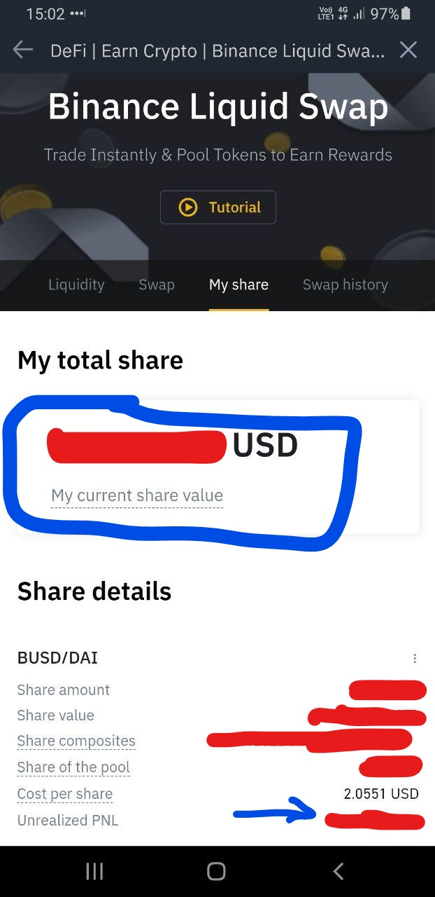

# Liquid swap

### \*\*\*\*

### **APY มาจากไหน**

มาจากเวลามีคนมาเทรดระหว่างเหรียญต่าง ๆ ที่อยู่ใน Liquidity swap โดยเราจะได้ดอกเบี้ยเมื่อมีคนมาเทรดในคู่ที่เราฝากไว้

### APY เยอะจริง จริงหรือไม่

จริงครับ แต่เฉพาะตอนนี้ ถ้าต่อไปมีคนมาใช้บริการน้อยลงก็จะได้ APY น้อยลงไปด้วย

### Liquid swap คำนวณดอกเบี้ยอย่างไร

ดูได้จาก 7-day APY ซึ่งเป็นค่าเฉลี่ยย้อนหลังเจ็ดวันของอัตราดอกเบี้ยรายปี

### ทำไมไม่ให้ตัวเลขตรง ๆ มาเลย ทำไมใช้ค่าเฉลี่ย

เนื่องจากดอกเบี้ยของ Liquid swap เปลี่ยนแปลงตลอดเวลา ขึ้นอยู่กับจำนวนผู้ใช้และ campaign ของ Binance ดังนั้นจึงไม่สามารถให้ตัวเลขตรง ๆ ได้ ถ้าผู้ใช้มากก็จะได้ดอกเบี้ยมากไปด้วย

### ประมาณการดอกเบี้ยที่จะได้รับได้หรือไม่

สามารถประมาณได้จากสูตร $$เงินต้น \times APY/365$$ เช่น หากมีเงินต้น $1000 และ APY 50% ก็จะได้ดอกเบี้ยประมาณ $$ $1000 \times 50\% / 365 = $1.37 $$ซึ่งเป็นเพียงการประมาณการเท่านั้น ดอกเบี้ยจริงจะมีการคำนวณอยู่ตลอดเวลาตามการใช้งานและ campaign ของ Binance

### ดอกเบี้ยที่ได้มา ดูตรงไหน

ดูได้จากหน้า My share ของ Liquid swap โดยสามารถดูได้สองจุด

1. My current share value บอกมูลค่ารวมทั้งหมดตอนนี้ เงินต้น + ดอกเบี้ย
2. Unrealized PNL บอกเฉพาะจำนวนดอกเบี้ยที่เราได้ หักด้วยค่า fee ต่าง ๆ หรือการแกว่งของราคาตลาดที่เกิดขึ้น

โดย unrealized PNL จะติดลบในช่วงวันแรก ๆ ที่ฝาก เนื่องจากจำเป็นต้องมีการจ่ายค่าธรรมเนียมในการฝากเงินเข้าไปใน liquid swap

### แล้วจะได้ดอกเบี้ยเมื่อไหร่

จะได้ดอกเบี้ยและเงินต้นคืน เมื่อเราทำการถอนเงินออกจาก liquid swap ด้วยการกด Redeem และเงินทั้งหมด \(รวมทั้งกำไรจากดอกเบี้ยด้วย\) จะถูกส่งไปยังกระเป๋า spot 

### มีเหรียญแบบเดียว ต้องซื้อทั้งสองเหรียญหรือไม่

ไม่จำเป็นครับ เพราะ Binance จะเปลี่ยนเหรียญเราให้อัตโนมัติ สุดท้ายเราจะถือ 50/50

### ความเสี่ยงอยู่ตรงไหน

ความเสี่ยงเยอะกว่า savings ครับ เลยได้ APY เยอะกว่า

หนึ่ง APY ไม่คงที่ ถ้าไม่มีคนใช้ เราก็ไม่ได้ return อะไรเลย

สอง เนื่องจากการฝากใน liquidity swap เราเป็น supplier ให้กับ pool หมายความว่า ถ้ามีเหรียญตัวใดตัวหนึ่งเสื่อมค่าและหลุดราคา $1 ที่สมควรจะเป็น stable เราจะได้แต่เหรียญไร้ค่าตัวนั้นกลับมา

เช่น ฝาก BUSD/DAI ถ้า DAI หลุด peg มีค่าแค่ $0.5 แทนที่จะเป็น $1 เวลาเราถอนออก เราจะไม่ได้ 50/50 แต่จะเป็นราว ๆ 25/75 แทน และได้ DAI ที่เสื่อมค่าไปแล้วกลับมาเยอะกว่า

ตัวนี้เรียกว่า impermanent loss ครับ

### น่าลงทุนหรือไม่

products ทุกตัวน่าสนใจหมดครับ ขึ้นอยู่กับว่าความเสี่ยงที่ได้กล่าวถึงไปแล้ว ตัวเราเองคิดว่าคุ้มค่ากับ return ที่เพิ่มขึ้นมาหรือไม่

