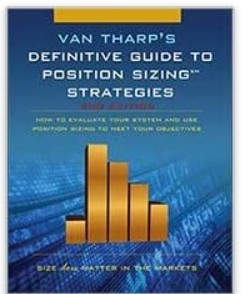

# System Quality Number \(SQN\)

ปัญหาของนักเทรดส่วนใหญ่คือ ถึงแม้จะกำไรก็ยังไม่มั่นใจอยู่ดีว่ากลยุทธ์ที่เราเทรด ๆ อยู่มันดีหรือไม่ดี ถ้าดี มันดีขนาดไหน อันนี้ ผมขอใช้ตัวอย่างจากนักเทรดในทีมคนหนึ่งนะครับ

โดย ผมจะใช้การวัดความยอดเยี่ยมของกลยุทธ์การเทรด โดยใช้การคำนวณ system quality number \(SQN\) ซึ่งถูกพัฒนาโดย Van Tharp ในหนังสือ The Definitive Guide to Position Sizing.

ถ้าใครสนใจไปอ่านต่อในหนังสือได้ แต่ถ้าใครยังไม่มีเวลาไปอ่าน ผมทำ [Google sheet](https://docs.google.com/spreadsheets/d/1A3uu4wnm2DqEaTx8uyjHQfYWiqbNDPbJVEOQexHWieQ/edit#gid=710699631) สำหรับคำนวณไว้ให้แล้ว

วิธีใช้อยู่ใน google sheet อยู่แล้วครับ copy google sheet ไปใช้ได้เลย

